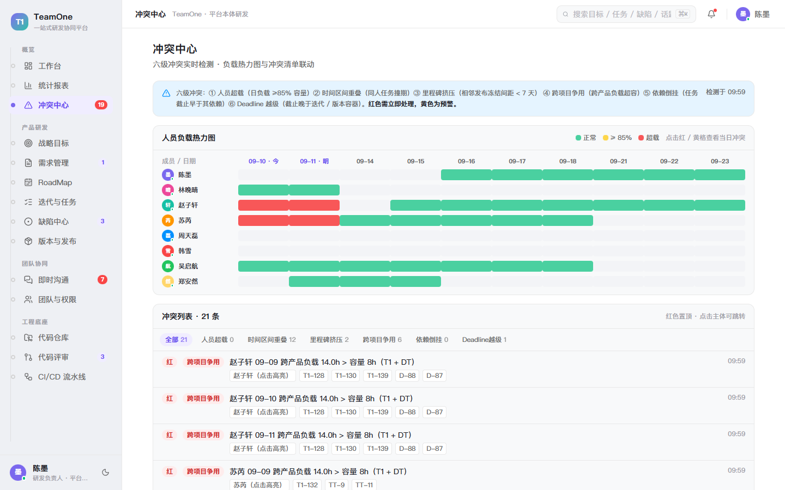
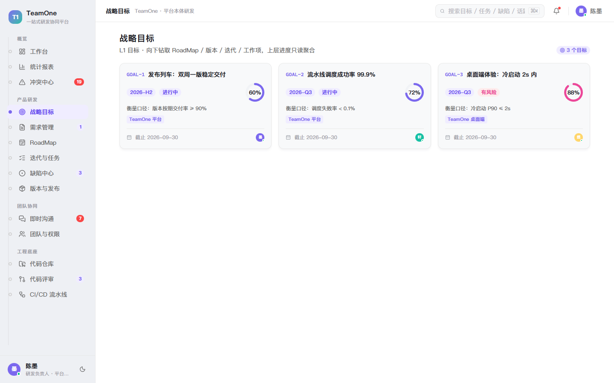
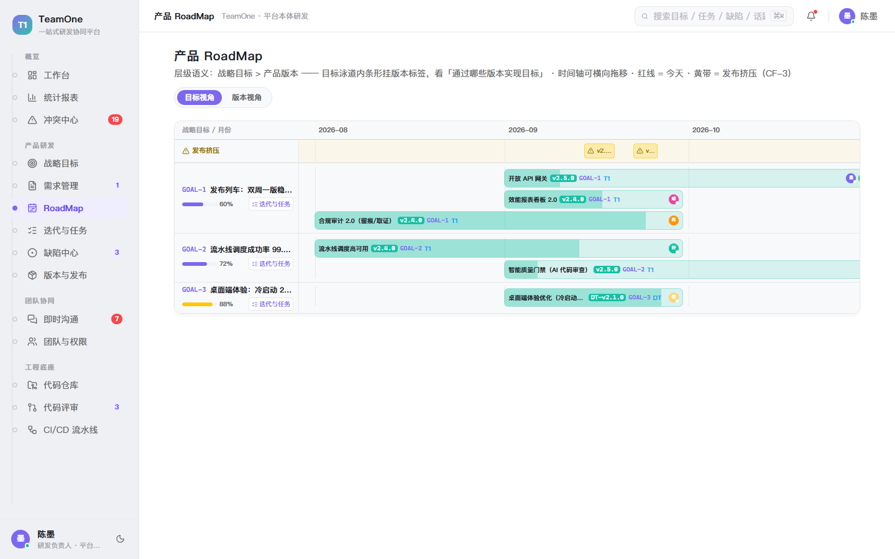
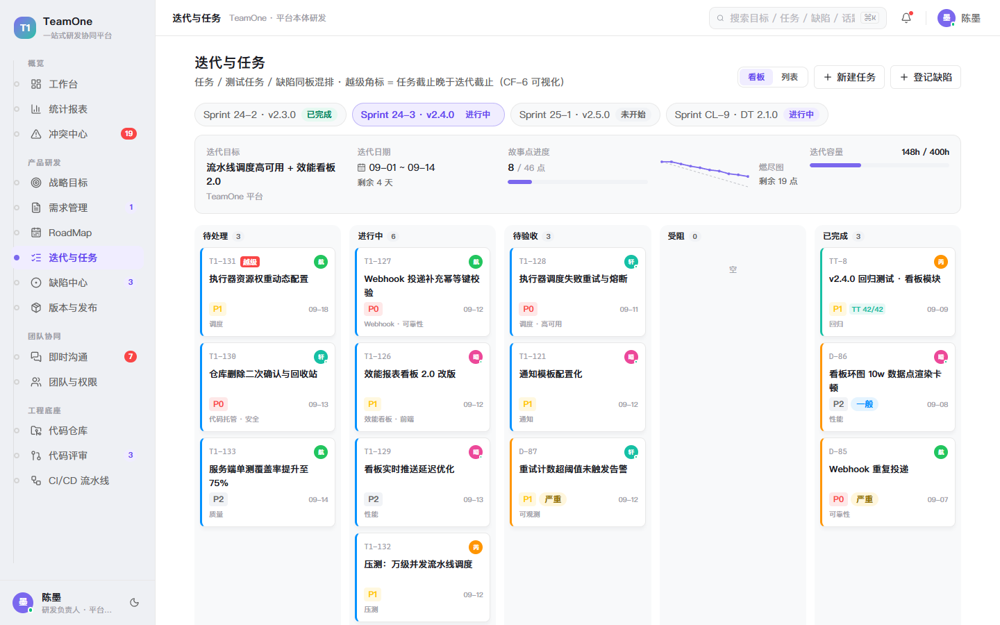
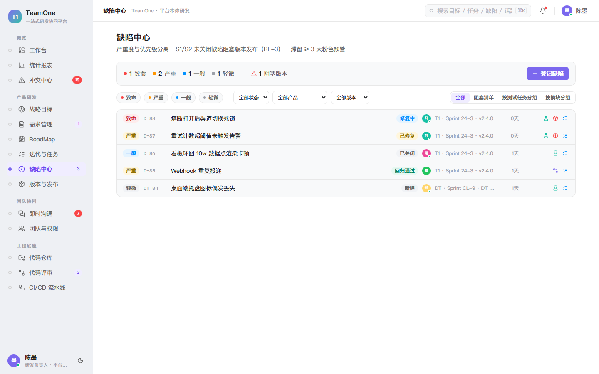
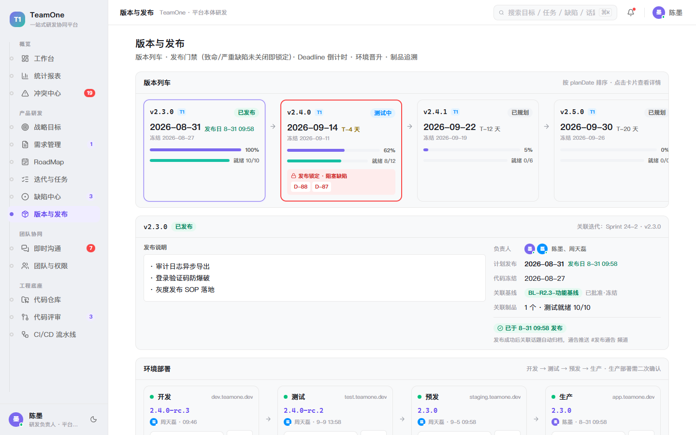
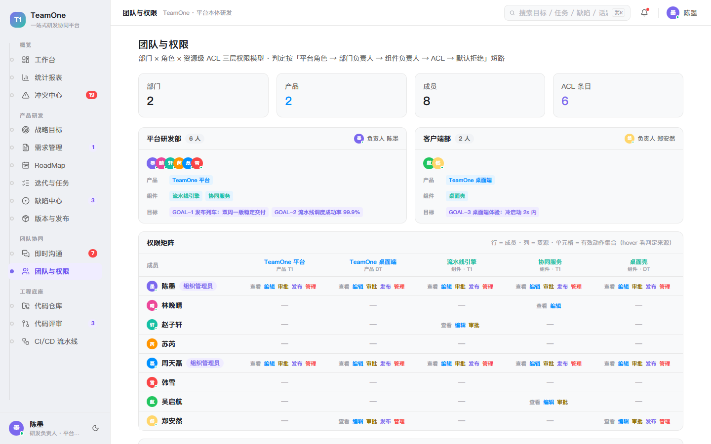
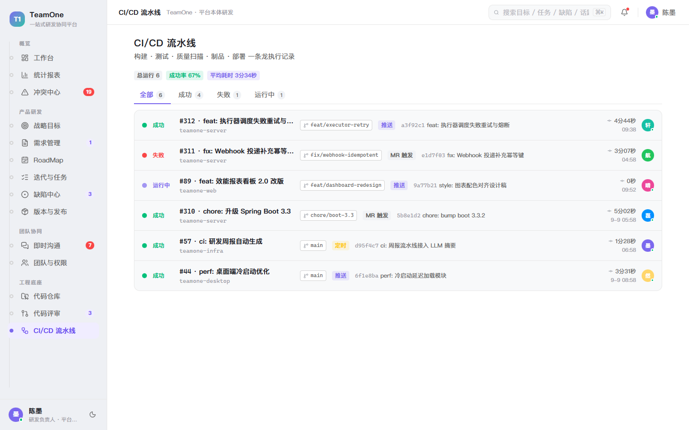

# TeamOne · 一站式研发协同平台（全栈工程）

<div align="center">

**Streamline Your R&D Workflow | OKR · Roadmap · Sprint · DevOps**

[](LICENSE)
[]()
[]()
[]()

[中文](README.md) | [English](README_EN.md)

</div>

> 本文件是 GitHub 公开仓库的 README 源（由 `deploy/sync-github.sh` 同步为仓库根 README.md）。

---

基于 Git 的一站式研发协同平台 **TeamOne**：把「战略目标 → 需求 → RoadMap → 版本 → 迭代 → 任务/测试任务/缺陷 → 代码评审 → CI/CD → 制品发布」的研发全流程搬到线上闭环，并以**对象化话题**串联团队协同。

> 演示场景：TeamOne 研发团队使用 TeamOne 开发 TeamOne 自己（Dogfooding）。

## 📁 仓库结构

```
├── web/              # 前端（React 19 + TS + Vite + Tailwind v4，可交互产品界面）
│   ├── src/          #   页面模块 / 数据仓库 / 共享组件
│   └── docs/screenshots/
├── server/           # 后端（Spring Boot 3.5 + JDK 17，Maven 七模块模块化单体）
│   ├── teamone-shared/      # 错误码目录/权限注解等零业务横切件
│   ├── teamone-platform/    # 用户/部门/ACL 四步短路授权链（对外 SPI）
│   ├── teamone-prd/         # 产品研发域（目标/版本/迭代/工作项，里程碑填充中）
│   ├── teamone-collab/      # 协同域（会话/消息/话题，里程碑填充中）
│   ├── teamone-eng/         # 工程底座域（自研 Git 内核 / MR 门禁 / 流水线，里程碑填充中）
│   ├── teamone-insight/     # 概览域（纯消费者，里程碑填充中）
│   └── teamone-app/         # Boot 装配：安全/JWT/WS 网关/Flyway
└── deploy/           # 部署与运维：compose（Valkey/MinIO）、一键起停、PG 建库备份、
                      # 自研 CI（ci.sh）、Git 内核引导（git-init-repo.sh）
```

## ✨ 功能一览

- **产品研发**：战略目标（五层下钻）、需求管理（评审流程：提交→多评审人通过→受理→排期）、RoadMap（目标/版本双视角 + 可横移时间轴 + 发布挤压预警）、迭代与任务（任务/测试任务/缺陷混排看板 + 容量条 + Deadline 越级预警）、缺陷中心（严重度彩标 + 阻塞版本门禁 + 四联跳转）、版本与发布（发布门禁：致命/严重缺陷未关闭自动锁定发布）
- **团队协同**：即时沟通（频道/话题/私聊三分类，归档折叠；消息可转话题、对象引用卡可跳转）、团队与权限（部门 × 角色 × 资源级 ACL 权限矩阵）
- **工程底座**：代码仓库（文件/提交/分支 + **WorkTree 工作副本与关系图** + **基线管理**：审批定版冻结）、代码评审（逐行 Diff、多评审人、**单元测试门禁**：覆盖率双阈值 + 豁免流程、rebase 拦截、冲突解决记录）、CI/CD（多阶段流水线 + Job 日志）
- **概览**：工作台（目标进度/我的冲突/发布门禁）、冲突中心（人员负载热力图 + 六类冲突判定 CF-1~6）、统计报表（燃尽/累积流/控制图/速率/缺陷分布/资源投入 + 绩效表 + CSV 导出）

## 📷 界面预览

| | | |
| --- | --- | --- |
| <br>**工作台** · 我的红色冲突、迭代容量、发布门禁、我的待办与话题 | <br>**统计报表** · 燃尽/累积流/控制图/速率/缺陷分布/资源投入 + 绩效表 + CSV 导出 | <br>**冲突中心** · 人员负载热力图 + 6 类冲突规则（CF-1~6） |
| <br>**战略目标** · 目标卡 + 五层下钻树（RoadMap → 版本 → 迭代 → 工作项） | <br>**需求管理** · 提交 → 多评审人通过 → 受理 → 排期 | <br>**产品 RoadMap** · 目标/版本双视角 + 里程碑挤压预警 |
| <br>**迭代与任务** · 任务/测试任务/缺陷混排看板 + 容量条 + Deadline 越级预警 | <br>**缺陷中心** · 严重度彩标 + 阻塞版本门禁 + 四联跳转 | <br>**版本与发布** · 发布门禁：致命/严重缺陷未关闭自动锁定 |
| <br>**即时沟通** · 频道/话题/私聊三分类 + 归档折叠 + 对象引用卡 | <br>**团队与权限** · 部门 × 角色 × 资源级 ACL 权限矩阵 | <br>**代码仓库** · 文件/提交/分支 + WorkTree 工作副本 + 基线管理 |
| <br>**代码评审** · 逐行 Diff + 单元测试门禁（双阈值 + 豁免流程） | <br>**CI/CD 流水线** · 多阶段流水线 + Job 日志 | |

## 🚀 运行

### 前端（可交互界面）

```bash
cd web
npm install
npm run dev      # 开发模式（默认 http://localhost:5173）
npm run build    # 生产构建 → web/dist/
```

### 后端（已实现：登录/JWT/刷新令牌旋转与吊销、ACL 四步授权链、WS 协议、Flyway 迁移）

```bash
# 前置：外部 PostgreSQL（连接信息写入 deploy/.env，参考 deploy/.env.example）
bash deploy/dev.sh run    # 构建并启动 http://localhost:8080（Windows 亦可用 deploy/dev.cmd）

# 开发种子账号（首次启动自动创建）
#   admin / Admin@123（OWNER，全量权限）
#   dev1  / Dev@12345（无授权 → 验证默认拒绝 403）
#   dev2  / Dev@12345（ACL 授予 user:list → 验证授予路径 200）
```

### 质量门（自研 CI）

```bash
bash deploy/ci.sh          # 单测 + ArchUnit 模块依赖纪律
bash deploy/ci.sh --full   # 追加 Testcontainers 集成测试（需 Docker）
```

## 🧱 技术栈

**前端**：React 19 + TypeScript + Vite · Tailwind CSS v4（Fancy 配色，`[data-theme="dark"]` 保留深色）· lucide-react 图标 · 内存数据仓库（`web/src/data/store.ts`）+ `useSyncExternalStore` 订阅刷新 · 冲突检测 `computeConflicts()`、话题干系人 `stakeholdersFor()` 等均为纯函数，可平移至后端

**后端**：Spring Boot 3.5.7 + JDK 17 模块化单体（Maven 七模块，ArchUnit 固化依赖纪律）· PostgreSQL + Flyway 全托管 · JWT（15min）+ 可吊销刷新令牌（旋转 + Valkey 存储）· 四步短路授权链 + 资源级 ACL · 自研 WebSocket 网关（auth/ready/ping/pong/ack 协议）· 事件驱动（事务性 Outbox → Valkey Stream，里程碑接入）

**Git 内核（自研）**：不引入任何外部 Git 服务——bare repo 本地托管 + 直接集成 git 命令（结构化封装为 GitPort），push 经 native `post-receive` hook 驱动 TeamOne 事件；MR 合并/冲突判定/diff 由服务端以 git 原语计算；CI 为自研流水线。设计与对照实现见项目内部文档。

## 🧭 里程碑进度

- ✅ **M0 框架搭建**：工程骨架、建库迁移、登录/ACL 矩阵、WS 骨架、错误信封——全部验收通过
- 🔄 **M1 纵向切片（进行中）**：工程化地基已完成（ArchUnit 七规则、Testcontainers 回归网、Valkey 底座、OpenAPI 契约、错误码目录、自研质量门）；下一步 prd 域全状态机与发布门禁
- 🔜 设计文档（调研/需求/设计/选型/架构/实施计划/内核决策）在内部仓库维护，暂未随本仓库公开

## 📄 License

Apache-2.0（仅用于演示与学习交流）。Git 内核实现以 Gitea（MIT）为设计参考，相关声明见内部 NOTICE。
