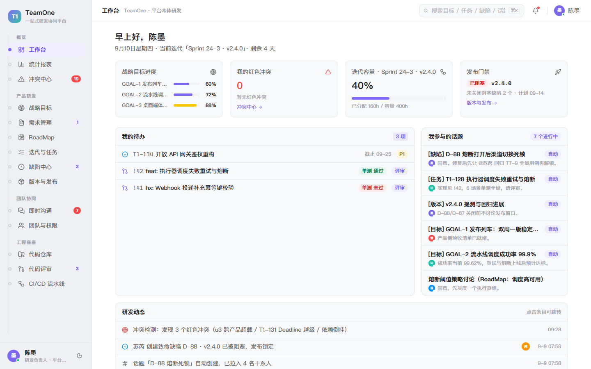
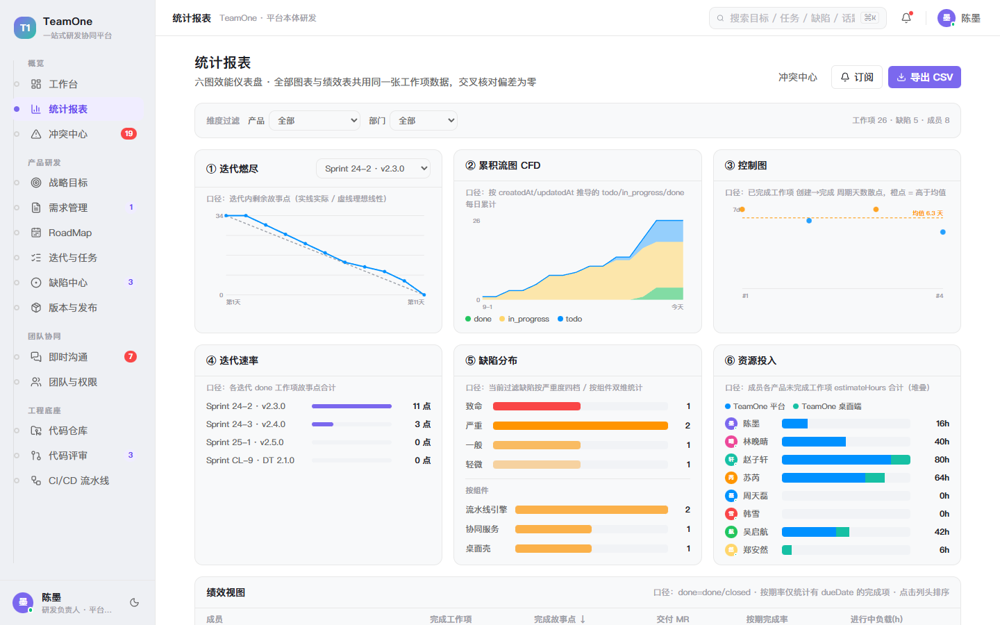
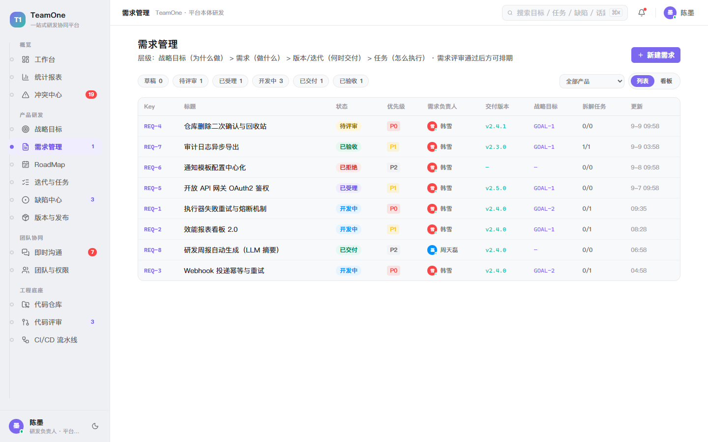
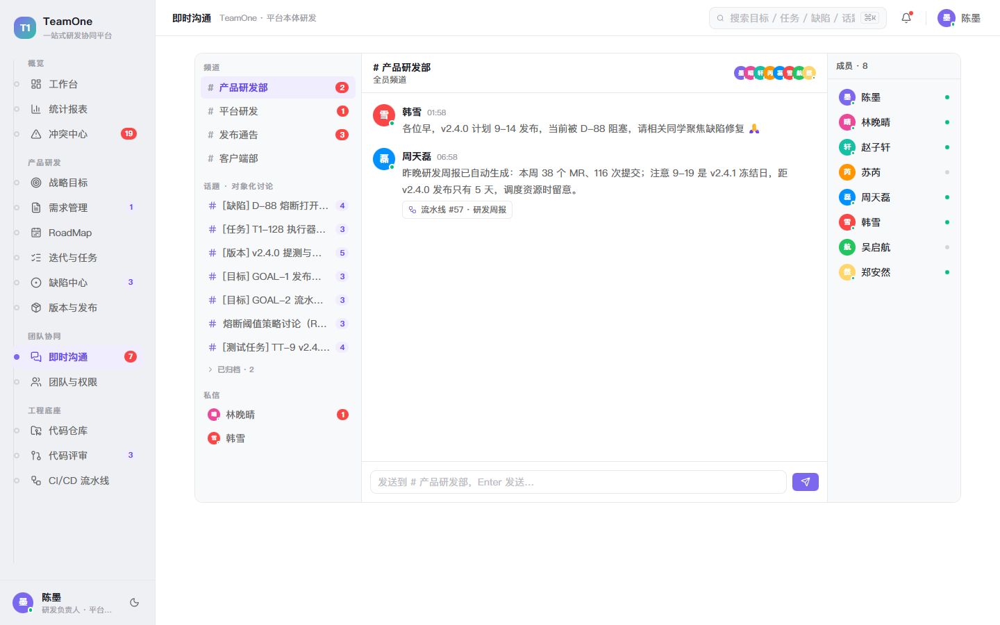
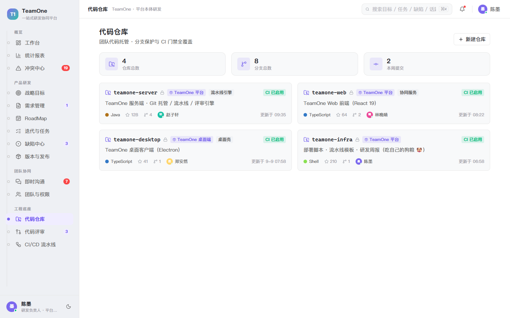
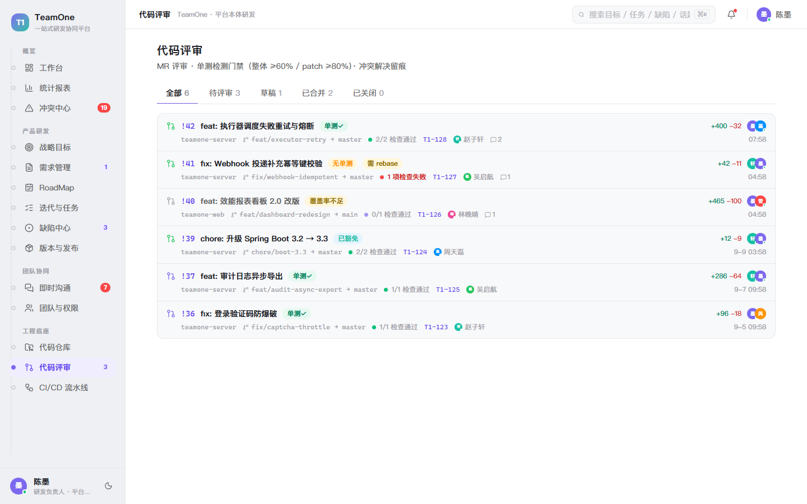

# TeamOne · All-in-One R&D Collaboration Platform (Full-Stack)

<div align="center">

**Streamline Your R&D Workflow | OKR · Roadmap · Sprint · DevOps**

[](LICENSE)
[]()
[]()
[]()

[中文](README.md) | [English](README_EN.md)

</div>

---

**TeamOne** is a Git-based all-in-one R&D collaboration platform. This repository now contains **two parts**: the interactive front-end prototype (React 19, repository root) and the back-end engineering skeleton (`server/`, a Spring Boot 3.5 modular monolith with auth / ACL / WebSocket / CI already implemented and accepted). It brings the full delivery loop online — **strategic goals → requirements → RoadMap → releases → sprints → tasks / test tasks / defects → code review → CI/CD → artifact release** — and ties team collaboration together with **object-centric topics**.

> Demo scenario: the TeamOne team builds TeamOne with TeamOne itself (dogfooding) — the build and tests of this very repository run on our self-hosted Gitea Actions.

See [README.md](README.md) (Chinese) for the full documentation, including backend quick-start and milestone progress.

## ✨ Features

- **Product & Delivery**
  - **Strategic goals** – five-level drill-down tree
  - **Requirements** – review workflow: submit → approved by multiple reviewers → accepted → scheduled
  - **RoadMap** – goal / release dual views, horizontally scrollable timeline, release squeeze warnings
  - **Sprints & tasks** – mixed board of tasks / test tasks / defects, capacity bars, deadline-override warnings
  - **Defect center** – severity color codes, release gating on blocking versions, four-way cross-links
  - **Releases** – release gate: publishing is locked automatically while critical / major defects remain open
- **Team Collaboration**
  - **Instant messaging** – channels / topics / DMs with archive folding; messages can be converted into topics and embedded object reference cards are clickable
  - **Team & permissions** – department × role × resource-level ACL permission matrix
- **Engineering Foundation**
  - **Code repositories** – files / commits / branches, **WorkTree working copies with relationship graph**, **baseline management** with approval-based freezing
  - **Code review** – line-by-line diff, multiple reviewers, **unit-test gate** with dual coverage thresholds plus an exemption flow, rebase interception, conflict-resolution records
  - **CI/CD** – multi-stage simulated pipeline execution with per-job logs
- **Overview**
  - **Dashboard** – goal progress, my conflicts, release gate status
  - **Conflict center** – workload heatmap plus six conflict rules (CF-1 ~ CF-6)
  - **Reports** – burndown / cumulative flow / control chart / velocity / defect distribution / resource investment, plus a performance table and CSV export

## 📷 Screenshots

| | | |
| --- | --- | --- |
| <br>**Dashboard** — my red conflicts, sprint capacity, release gate, my todos and topics | <br>**Reports** — burndown / cumulative flow / control chart / velocity / defect distribution / resource investment, plus a performance table and CSV export | <br>**Conflict Center** — workload heatmap + six conflict rules (CF-1 ~ CF-6) |
| <br>**Strategic Goals** — goal cards plus a five-level drill-down tree (RoadMap → release → sprint → work item) | <br>**Requirements** — submit → multiple reviewers approve → accept → schedule | <br>**Product RoadMap** — goal/release dual views plus milestone squeeze warnings |
| <br>**Sprints & Tasks** — mixed board of tasks / test tasks / defects with capacity bars and deadline-override warnings | <br>**Defect Center** — severity color codes, release gate on blocking versions, four-way cross-links | <br>**Releases** — release gate: publishing is locked automatically while critical / major defects remain open |
| <br>**Instant Messaging** — channels / topics / DMs with archive folding and clickable object reference cards | <br>**Team & Permissions** — department × role × resource-level ACL matrix | <br>**Code Repositories** — files / commits / branches plus WorkTree working copies and baseline management |
| <br>**Code Review** — line-by-line diff plus a unit-test gate with dual coverage thresholds and an exemption flow | <br>**CI/CD Pipelines** — multi-stage simulated pipeline execution with per-job logs | |

## 🚀 Getting Started

```bash
npm install
npm run dev      # dev server (default http://localhost:5173)
npm run build    # production build -> dist/
npm run preview  # preview the built output locally
```

## 🧱 Tech Stack

- React 19 + TypeScript + Vite
- Tailwind CSS v4 (Fancy color theme, dark values preserved under `[data-theme="dark"]`)
- `lucide-react` icons; no backend and no additional runtime dependencies
- In-memory data store (`src/data/store.ts`) with `useSyncExternalStore` for subscription-based refresh, simulating real-time behavior: pipeline execution, environment deployment, IM replies, and automatic topic archiving
- Pure functions such as conflict detection `computeConflicts()` and topic stakeholders `stakeholdersFor()` — portable to a backend as-is

## 📁 Project Structure

```
src/
├── data/           # Type definitions + in-memory store (seed data / actions / pure algorithms)
├── components/     # Shared UI atoms (Avatar/Pill/ProgressRing/HeatCell…)
├── features/       # Page modules (dashboard/goals/requirements/roadmap/tasks/
│                   #   defects/delivery/topics(im)/team/conflicts/reports/
│                   #   repos/review/cicd)
├── nav.ts          # Navigation config and page props contract
└── App.tsx         # App shell (sidebar main-track nav + top bar + routing)
```

## 📄 License

Apache-2.0 (for prototype demonstration and learning purposes only)
